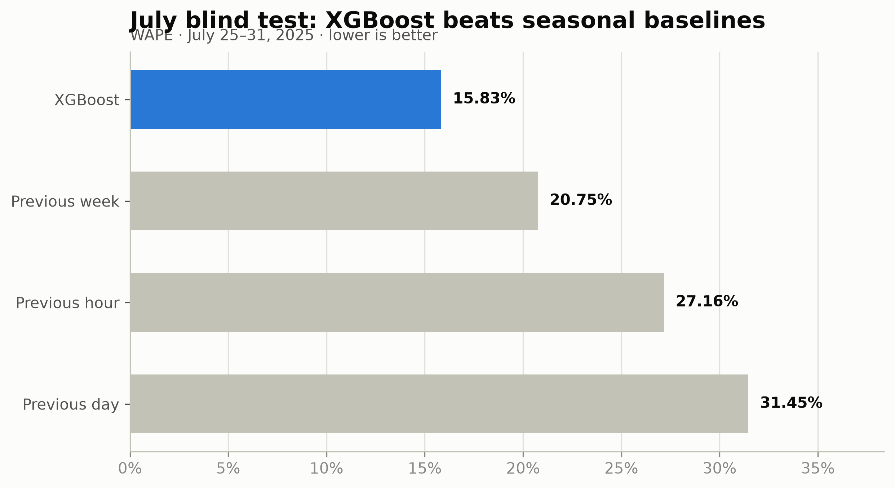
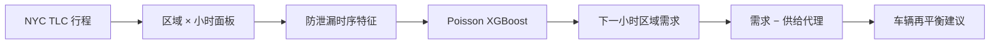
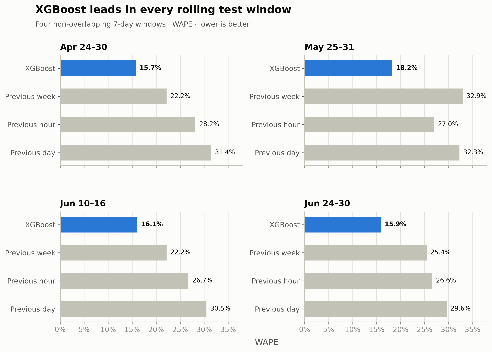
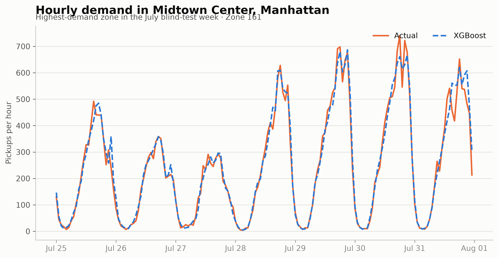
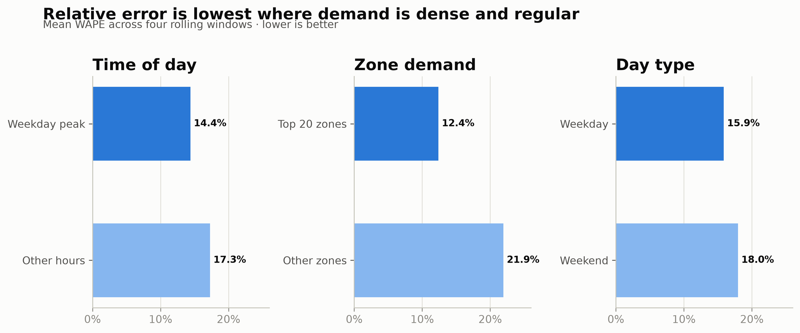
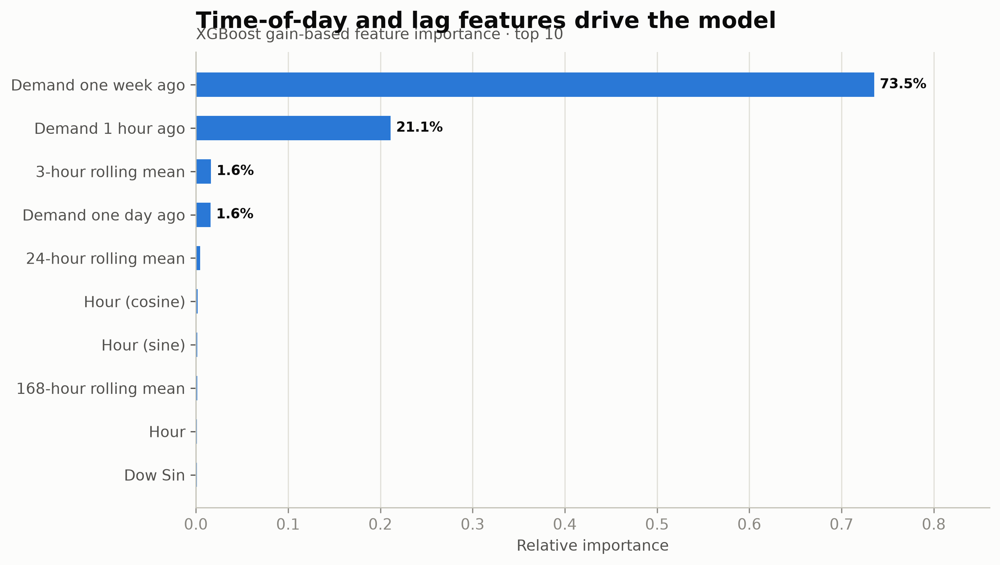
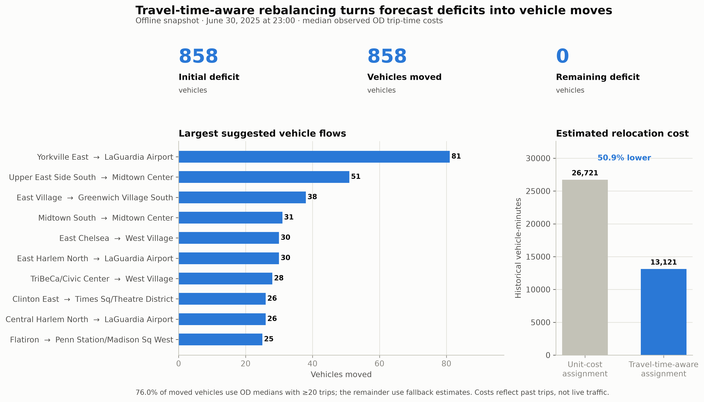

# 城市出租车需求预测与车辆再平衡｜XGBoost

[中文](README.md) | [English](README_EN.md)

> 基于约 **2,776 万条** NYC Yellow Taxi 行程，预测 226 个区域下一小时的上车需求，并将预测结果转化为车辆再平衡建议。

**交互演示：**运行 `streamlit run app.py`，浏览锁参后的 7 月预测与基于历史区域间行程时间的再平衡快照。

## 项目结果

| 数据规模 | 最终盲测 WAPE | 最强基线 WAPE | 相对改善 |
|---:|---:|---:|---:|
| 27.76M 有效行程 | **15.83%** | 20.75% | **23.72%** |

- 最终结果来自**参数锁定后的 2025 年 7 月盲测**，未根据盲测结果再次调参。
- 4 个跨月滚动窗口平均 WAPE 为 **16.48% ± 1.18%**，模型没有只在某一周有效。
- 误差主要集中在**低需求区域和周末**；高需求 Top 20 区域的相对误差更低。
- 实现满足车辆守恒的再平衡 MVP，形成“需求预测 → 缺口识别 → 调度建议”闭环。



## 为什么做这个项目

出租车平台面临的核心问题不是全城总需求不足，而是**车辆所在区域与下一小时乘客需求出现的区域不一致**。如果能够提前预测各区域需求，就可以在缺车发生前识别潜在供需缺口。

本项目因此分为两层：

1. **预测层：**预测每个 taxi zone 下一小时的已实现上车需求；
2. **决策层：**结合区域供给代理，生成从富余区域到缺车区域的车辆移动建议。



> TLC 只记录已经完成的行程，因此模型预测的是**已实现需求**，不是包含未满足乘车请求的完整潜在需求。

## 数据工程

数据来自 [NYC TLC Trip Record Data](https://www.nyc.gov/site/tlc/about/tlc-trip-record-data.page)，覆盖 2025 年 1–7 月 Yellow Taxi 行程。

| 数据 | 规模 |
|---|---:|
| 1–6 月有效行程 | 23,896,401 |
| 7 月有效行程 | 3,866,132 |
| 区域数量 | 226 |
| 1–6 月区域小时样本 | 981,744 |

为处理数千万条明细数据，流水线逐月读取必要列、清洗并聚合，而不是一次性加载全部行程。主要处理包括：

- 移除非法时间、无效区域、倒序行程和超过 6 小时的异常行程；
- 分别统计每个区域每小时的上车量和下车量；
- 补齐区域小时组合，构建平衡面板；
- 只以上车时间定义目标面板边界，避免跨月下车记录制造未来的伪零需求；
- 下载采用临时文件和原子替换，并校验 Parquet 与 ZIP 完整性。

## 模型与防泄漏设计

出租车需求同时具有短期惯性、日内周期和周周期。模型使用以下信息：

- **需求滞后：**1、2、3、24、168 小时；
- **历史统计：**3、6、24、168 小时滚动均值与标准差；
- **日历周期：**小时、星期、月份、周末标记及周期编码；
- **供给代理：**每个区域上一小时的下车量。

核心模型为 `XGBRegressor(objective="count:poisson")`。Poisson 目标适合非负计数；树模型可以学习区域、时间和历史需求之间的非线性关系。

为避免得到虚高结果，项目做了四层约束：

1. 滞后特征始终按区域分组后 `shift`；
2. 滚动统计先执行 `shift(1)`，当前小时目标不会进入特征；
3. 训练、验证和测试严格按时间顺序切分，不使用随机拆分；
4. Top 20 高需求区域只根据每一折训练期确定。

相关规则均有自动化测试覆盖。

## 如何证明模型能够泛化

实验不是只保留一个表现较好的测试周，而是按时间分为三个角色：

| 阶段 | 数据用途 |
|---|---|
| 1–4 月 | 特征开发与时序调参 |
| 4–6 月多个窗口 | 滚动稳健性和分组误差评估 |
| 7 月 | 参数锁定后的最终盲测 |

每个实验使用扩展训练窗口、紧邻测试期之前的 7 天验证集，以及之后的 7 天测试集。验证集用于 early stopping。模型与三个无需训练的强基线比较：**上一小时、昨日同期、上周同期**。

### 跨月滚动验证



XGBoost 在 4 个窗口中均优于三个基线，测试 WAPE 分别为 **15.73%、18.23%、16.06% 和 15.88%**，平均为 **16.48% ± 1.18%**。平均测试—训练 WAPE 差为 2.54 个百分点，存在正常泛化损失，但没有未来窗口性能崩溃。

### 时序调参

在 3 个较早的开发窗口上，比较 16 个固定随机种子生成的参数组合和 1 个人工参数基准，并且只按开发期平均 WAPE 选参。

锁定参数：

```json
{
  "learning_rate": 0.03,
  "max_depth": 10,
  "min_child_weight": 5,
  "subsample": 0.85,
  "colsample_bytree": 0.7,
  "reg_lambda": 20.0,
  "reg_alpha": 1.0
}
```

选中参数在 3/3 个后续比较窗口胜出，平均 WAPE 从 16.55% 降至 **16.32%**，相对改善 **1.40%**。这是小而稳定的提升，说明原人工参数已经合理；调参的主要价值是建立可复现的选择依据，而不是制造夸张增益。

## 7 月最终盲测

参数锁定后才下载和处理 7 月数据。模型使用截至 7 月 17 日的数据训练，7 月 18–24 日用于 early stopping，7 月 25–31 日只评估一次。

| 模型 | MAE | RMSE | WAPE | 整体 R² |
|---|---:|---:|---:|---:|
| **XGBoost** | **3.89** | **9.84** | **15.83%** | **0.9741** |
| 上周同期 | 5.10 | 13.33 | 20.75% | 0.9525 |
| 上一小时 | 6.67 | 17.49 | 27.16% | 0.9183 |
| 昨日同期 | 7.73 | 23.45 | 31.45% | 0.8531 |

XGBoost 相比最佳基线将 WAPE 相对降低 **23.72%**。下图为盲测周需求最高区域 Midtown Center 的小时预测：模型能够跟随主要日内周期，但部分尖峰仍被平滑或低估。



> 最佳迭代达到配置的 2,000 轮上限。由于这一信息是在盲测后观察到的，项目没有提高上限并重新评估 7 月；后续调整应使用新的月份验证。

## 模型在哪些场景容易出错



- **高峰 vs. 其他时段：**14.39% vs. 17.28%；
- **Top 20 高需求区域 vs. 其他区域：**12.39% vs. 21.94%；
- **工作日 vs. 周末：**15.87% vs. 17.96%。

Top 20 区域的绝对误差较大，但相对误差更低。真正的薄弱点是低需求区域和周末：计数更稀疏，偶发变化所占比例也更高。



XGBoost 内置重要性显示，时间周期编码和历史需求滞后共同驱动预测。该指标只反映模型分裂贡献，**不代表因果关系**。

### 为什么整体 R² 很高

0.9741 是将所有区域小时合并计算的 pooled R²。不同区域的平均需求规模相差很大，区域之间的规模差异贡献了大量可解释方差，因此它不能称为“97.41% 准确率”。

作为补充诊断，区域 R² 中位数为 0.3279，96.46% 的区域 R² 为正。项目因此将 WAPE、跨时间稳定性和分组结果作为主要判断依据。

## 从需求预测到行程时间感知的车辆再平衡

决策层使用上一小时区域下车量近似当前可用车辆：

```text
预计区域缺口 = 下一小时预测需求 − 上一小时下车量
```

现有调度器接收任意起终点成本矩阵，按成本从低到高匹配富余车辆和预测缺口，并保证每个起点不超调、每个终点不超配及全局车辆守恒。这里使用快照发生前的真实 TLC 行程，按 `起点区域 → 终点区域` 统计**历史中位行程时间**作为调度成本；只有样本不足 20 条的稀疏 OD 对才使用起点、终点或全局中位数回退值。



图中快照来自 **2025-06-30 23:00**，与 7 月盲测不是同一批结果。858 辆预测缺口均被匹配；按相同历史 OD 时间回算，行程时间感知方案的估计成本为 **13,121 vehicle-minutes**，统一成本方案为 26,721，相对降低 **50.89%**。其中 **75.99%** 的调动车辆使用样本量至少 20 的直接 OD 中位时间，其余使用明确回退值。成本来自历史已完成行程，不代表实时交通；该降幅是离线成本函数结果，不是乘客等待时间或真实空驶时间改善。贪心策略也不保证运输问题的全局最优解。

当前版本的目标是证明预测能够进入可约束的决策流程，而不是复刻完整平台调度系统，因此**不能声称已经降低真实等待时间或空驶距离**。生产化仍需加入：

- 实时车辆位置和在途状态；
- 路网时间与跨区移动成本；
- 司机接受概率和运力约束；
- 区域服务公平性；
- 最小费用流或滚动时域优化；
- 历史回放仿真及在线实验。

## 交互演示

Streamlit 将预测结果、调度 KPI、主要车辆流向和区域级供需状态集中在一个可筛选页面中：

```bash
python -m src.rebalancing_report
python -m src.visualize
streamlit run app.py
```

页面包含：

- **July blind-test forecast：**选择任意区域，查看 7 月 25–31 日实际与预测曲线及区域 WAPE；
- **June rebalancing snapshot：**查看调度 KPI、按行政区和车辆数筛选主要流向、检查区域级供需状态；
- **Scope & protocol：**明确两个时间快照、供给代理、距离成本和离线模拟的口径。

该结构可直接部署至 Streamlit Community Cloud。实际公网发布属于外部操作，不在本地构建过程中自动执行。

## 快速复现

环境：Python 3.11。

```bash
python -m venv .venv
.venv\Scripts\activate
pip install -r requirements.txt

# 下载并校验数据
python -m src.download_data --year 2025 --start-month 1 --end-month 7

# 完整实验
python -m src.pipeline --config configs/baseline.json
python -m src.tuning --config configs/tuning.json
python -m src.rolling_validation --config configs/rolling_validation.json
python -m src.blind_test --config configs/blind_test.json

# 构建行程时间感知调度报告并生成图表
python -m src.rebalancing_report
python -m src.visualize

# 启动交互演示
streamlit run app.py

# 自动化测试
python -m pytest
```

## 项目结构

```text
configs/                 实验与锁参配置
src/data.py              数据清洗、聚合和面板扩展
src/features.py          防泄漏时序特征
src/model.py             XGBoost、基线与指标
src/evaluation.py        时间折和分组评估
src/tuning.py            时序安全参数搜索
src/blind_test.py        锁参后的最终测试
src/rebalancing.py       成本感知车辆再平衡
src/rebalancing_report.py 调度快照与演示数据
src/visualize.py         静态结果图表
app.py                   Streamlit 结果演示
reports/                 调参、滚动验证及盲测结果
tests/                   泄漏、时间切分、选参及守恒测试
```

## 局限与未来优化方向

当前版本已经完成从需求预测到调度建议的离线闭环，但仍有明确的生产化边界：TLC 只记录已完成行程，无法观察因无车而流失的需求；供给由上一小时下车量近似；调度成本来自历史 OD 行程时间，不能代表实时路况；贪心匹配也不保证全局最优。

后续可沿以下方向继续优化，本项目暂不展开：

1. **补充外生变量：**加入天气、节假日、大型活动和实时交通，提高异常日期及需求突变场景的预测能力；
2. **升级全局优化：**用最小费用流或线性规划替代贪心匹配，在车辆守恒和运力约束下求解全局最低调度成本；
3. **改进供给估计：**接入实时车辆位置、空载状态和在途信息，替代“上一小时下车量”代理；
4. **使用实时道路成本：**接入道路行程时间 API，替代历史 OD 中位时间，并随实时拥堵动态更新；
5. **保留新的盲测月份：**将 8 月及之后数据留作新一轮未见测试，避免反复利用 7 月盲测反馈；
6. **开展历史回放仿真：**模拟车辆随时间移动与需求到达，进一步评估乘客等待时间、完单率和空驶时间，而不只比较静态成本函数。

这些方向是从离线原型走向生产系统的自然延伸，不影响当前版本用于展示 XGBoost、时序验证和预测决策闭环的完整性。
